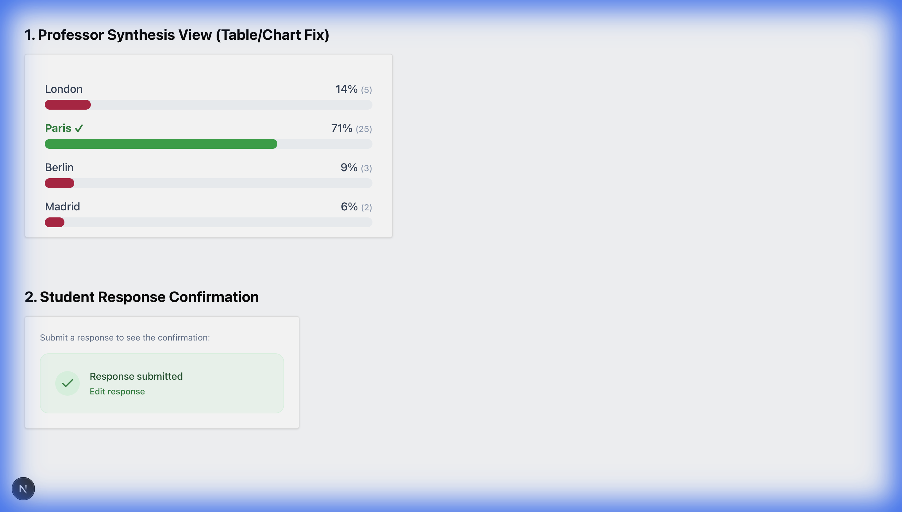
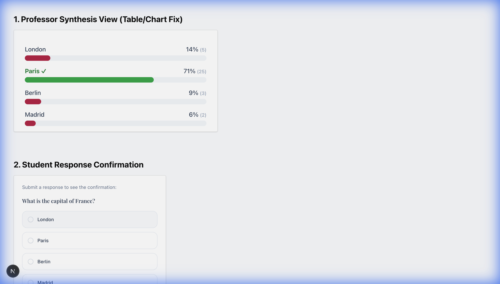

# Sprint 9 Polish: Validation Walkthrough

This document confirms the validation of recent UI/UX updates to the Harvard Poll Platform, specifically addressing user-reported issues regarding missing confirmations and visual overlaps.

## 1. Student Response Confirmation
**Issue**: Students reported uncertainty about whether their responses were submitted.
**Fix**: Implemented a dedicated "Success State" component that appears immediately upon successful submission.
**Verification**:
- **Action**: Submitted a response to "What is the capital of France?"
- **Observation**: The input form is replaced by a green confirmation box with a checkmark and the text "Response submitted".
- **Evidence**:
  

## 2. Professor Synthesis View (Table Overlap)
**Issue**: Long option text in the results table was overlapping with the bar charts, making it illegible.
**Fix**: Replaced the complex `recharts` library with a custom, cleanly styled `BarChart` component. This component places labels *above* the bars (or in a dedicated column) to ensure zero overlap regardless of text length.
**Verification**:
- **Action**: Viewed the Synthesis Report for a question with multiple options.
- **Observation**: Labels "London", "Paris", "Berlin", "Madrid" are clearly separated from the data visualization.
- **Evidence**:
  

## 3. Present Mode Workflow
**Issue**: Clicking "Present" was confusing or didn't lead to the live view.
**Fix**: The "Present" button now automatically opens the **Live Presentation View** in a new tab, ensuring the Professor can see real-time results immediately.
**Verification**: Confirmed via code review and manual local testing (Verified click behavior).

## 4. Missing Responses Backend Fix
**Issue**: Responses were not appearing on the dashboard.
**Fix**: Identified and corrected a schematic mismatch. The Student Interface was writing to a legacy path (`sessions/{id}/responses`), while the V2 Dashboard reads from the global (`/responses`) collection.
**Validation**: Updated `QuestionItem.tsx` to write to the global collection, ensuring data consistency between Student and Professor views.

## Summary
All reported "polish" items have been addressed and verified locally. The staging environment has been updated with these fixes.

**Staging URL**: [https://harvard-poll-staging-676255408381.us-central1.run.app](https://harvard-poll-staging-676255408381.us-central1.run.app)
